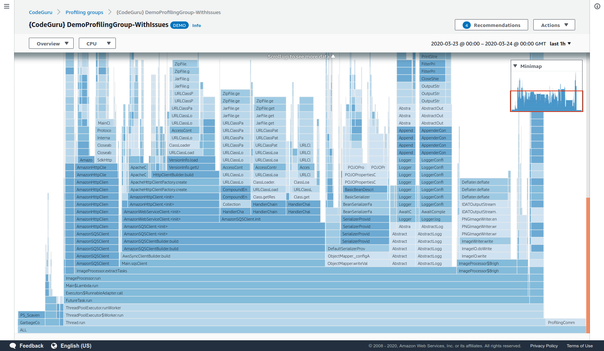

# Amazon CodeGuru Profiler demo application

Simple application for demonstrating the features of [Amazon CodeGuru Profiler](https://aws.amazon.com/codeguru/).



## Quick demo

The results of this app are available to play with in the AWS console.
There is no need to run the code, if you just want to see the results.

1. Sign into the [AWS console](https://console.aws.amazon.com)
2. Head to CodeGuru Profiler and check out [the demo app](https://console.aws.amazon.com/codeguru/profiler/profile?profileName=%7BCodeGuru%7D%20DemoProfilingGroup-WithIssues)

## How it works

The application does some basic image processing, with some CPU-heavy
operations alongside some IO-heavy operations.

It consists chiefly of two components which run in parallel, the task publisher
and the image processor.

CodeGuru Profiler runs inside the application, in the same way any real application
would use it. It collects and reports profiling data about the application, ready to
be viewed in the AWS console.

##### [`TaskPublisher`](src/main/java/com/company/demoapplication/TaskPublisher.java)

Checks the S3 bucket for available images, and submits the name of some of these images
to the SQS queue.

##### [`ImageProcessor`](src/main/java/com/company/demoapplication/ImageProcessor.java)

Polls SQS for names of images to process. Processing an image involves downloading
it from S3, applying some image transforms (e.g. converting to monochrome), and
uploading the result back to S3.

## Setup

Make sure you have installed the latest version of [AWS CLI](https://docs.aws.amazon.com/cli/latest/userguide/cli-chap-welcome.html).

Setup the required components by running the following ```aws``` commands:

1. Create two profiling groups in CodeGuru Profiler, named `DemoApplication-WithIssues` and `DemoApplication-WithoutIssues`
2. Create an SQS queue
3. Create an S3 bucket
4. Install [Maven](https://maven.apache.org/) (to build and run the code).
5. Create/use an IAM role with permissions to access SQS, S3 and CodeGuru Profiler

```bash
aws configure # Set up your AWS credentials and region as usual
aws codeguruprofiler create-profiling-group --profiling-group-name DemoApplication-WithIssues
aws codeguruprofiler create-profiling-group --profiling-group-name DemoApplication-WithoutIssues
aws s3 mb s3://demo-application-test-bucket-1092734-REPLACE-ME
aws sqs create-queue --queue-name DemoApplicationQueue
```

## How to run

The demo application can be run in two modes: `with-issues` and `without-issues`. Thus, you can compare how an
optimized version of the application compares to one with performance issues.

* To run the `with-issues` version, use the following instructions. Remember to replace `YOUR-ACCOUNT-ID`, `YOUR-AWS-REGION` and `YOUR-BUCKET-REPLACE-ME` as appropriate.

```bash
# These need to be set according to your setup:
export DEMO_APP_SQS_URL=https://sqs.YOUR-AWS-REGION.amazonaws.com/YOUR-ACCOUNT-ID/DemoApplicationQueue
export DEMO_APP_BUCKET_NAME=demo-application-test-bucket-1092734-YOUR-BUCKET-REPLACE-ME
export AWS_CODEGURU_TARGET_REGION=YOUR-AWS-REGION

# Run the demo!
export AWS_CODEGURU_PROFILER_GROUP_NAME=DemoApplication-WithIssues
mvn clean install # generates the DemoApplication-1.0-jar-with-dependencies.jar
java -javaagent:codeguru-profiler-java-agent-standalone-1.2.2.jar \
  -jar target/DemoApplication-1.0-jar-with-dependencies.jar with-issues
```

* To run the `without-issues` version, use the following instructions. Remember to replace `YOUR-ACCOUNT-ID`, `YOUR-AWS-REGION` and `YOUR-BUCKET-REPLACE-ME` as appropriate.

```bash
# These need to be set according to your setup:
export DEMO_APP_SQS_URL=https://sqs.YOUR-AWS-REGION.amazonaws.com/YOUR-ACCOUNT-ID/DemoApplicationQueue
export DEMO_APP_BUCKET_NAME=demo-application-test-bucket-1092734-YOUR-BUCKET-REPLACE-ME
export AWS_CODEGURU_TARGET_REGION=YOUR-AWS-REGION

# Run the demo!
export AWS_CODEGURU_PROFILER_GROUP_NAME=DemoApplication-WithoutIssues
mvn clean install # generates the DemoApplication-1.0-jar-with-dependencies.jar
java -javaagent:codeguru-profiler-java-agent-standalone-1.2.2.jar \
  -jar target/DemoApplication-1.0-jar-with-dependencies.jar without-issues
```

Run this for a few hours to get plenty of data, along with a recommendations report.

**Note**: When running `with-issues`, you'll see plenty of `Expensive exception`, `Pointless work` and other debug
gibberish being logged. This is **expected**! This is an example of a badly coded application, and you'll be able to see
how these issues show up on the CodeGuru Profiler console.

So don't worry 😎 -- we totally know about it.

### License

This code is licensed under the MIT-0 License. See the [LICENSE](LICENSE) file.
